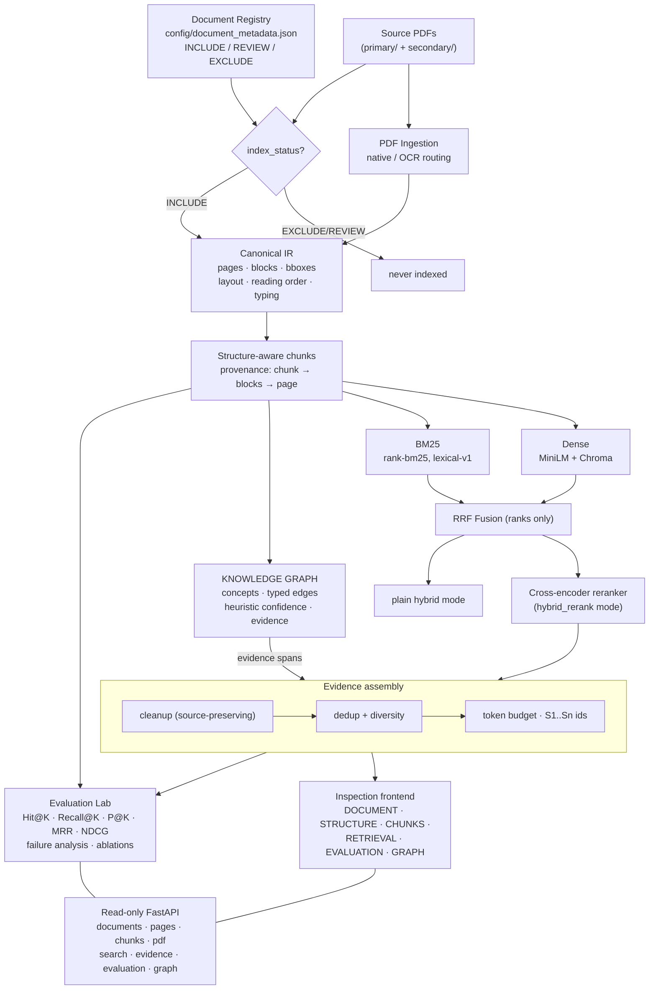

# Jung Archive — Final Architecture (M7)



## Provenance invariant

Every trusted graph edge and every evidence item resolves to:

```text
graph node/edge
  → GraphEvidence (immutable span)
    → chunk artifact
      → source block IDs
        → page number(s)
          → original PDF region
```

Anything that cannot be traced is marked WEAK/UNVERIFIED or excluded.
```
