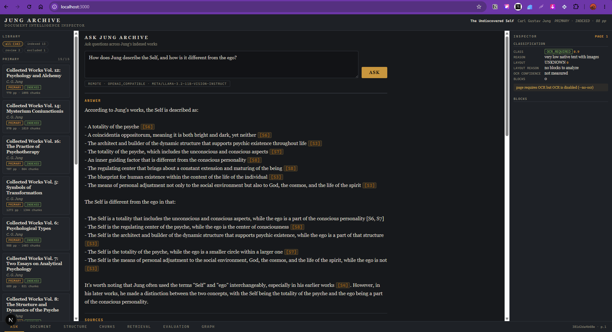
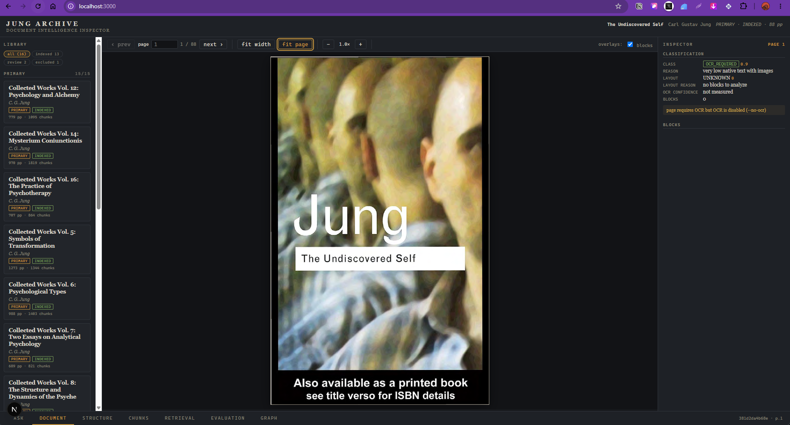
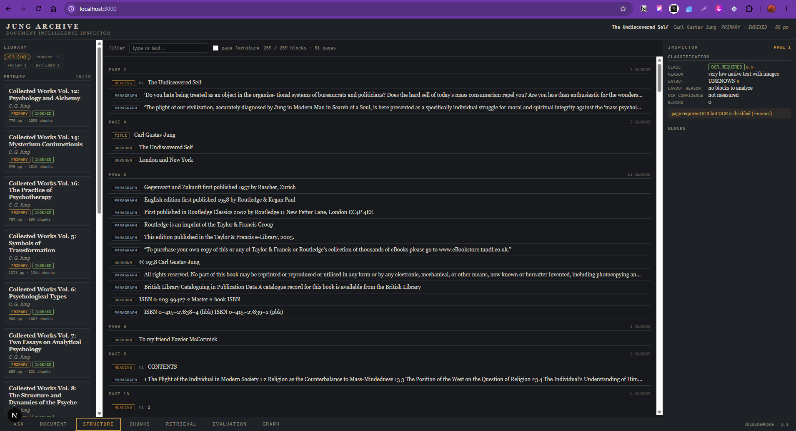
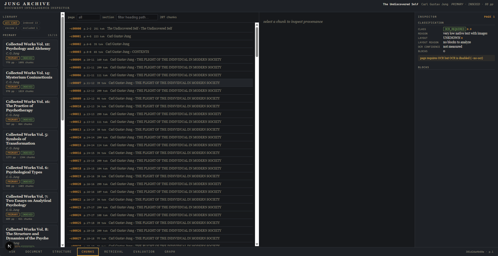
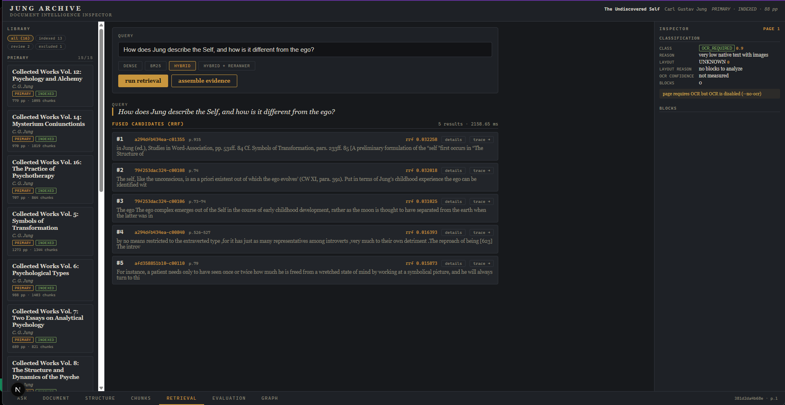
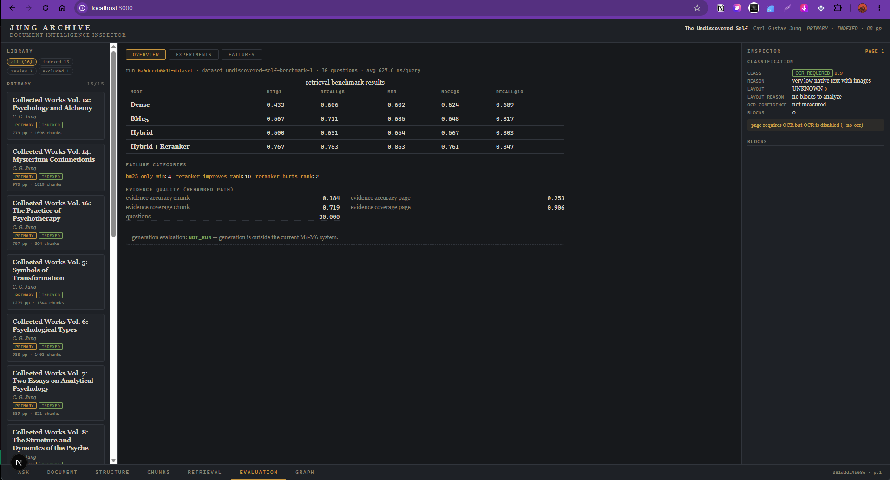
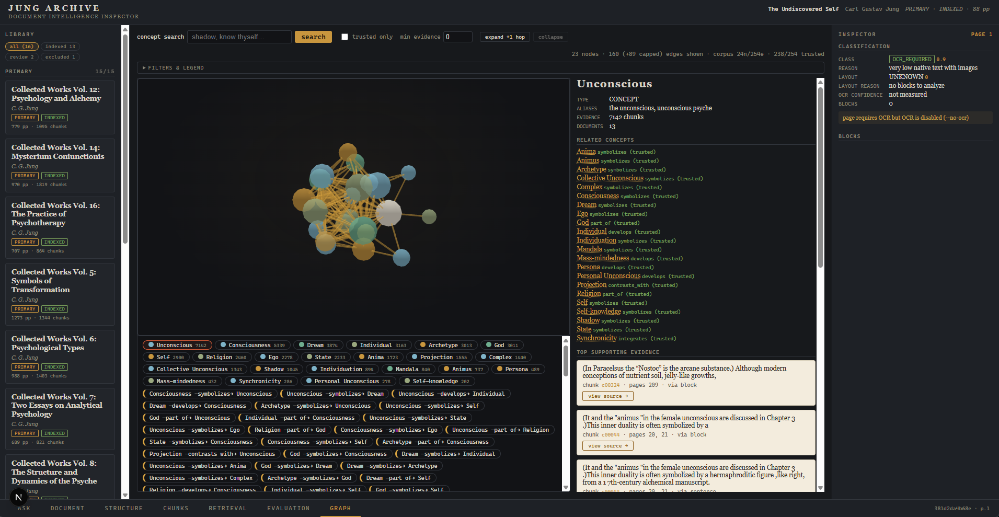

# Jung Archive

A document-intelligence and retrieval-inspection workstation for the Carl Jung corpus — built to make every stage of processing **observable**, **traceable**, and **measurable**: from PDF pages to parsed blocks, chunks, hybrid retrieval, cross-encoder reranking, evidence assembly, evaluation, and an evidence-backed knowledge graph.

> Local-first, evidence-backed research — not a chatbot. ASK is one layer on top of a measured retrieval system.



---

## What It Is

Jung Archive is a local-first document intelligence and evidence-backed research system demonstrated on Jung's works. Every stage is inspectable: classification and OCR routing, layout and block typing, structure-aware chunking, dense + lexical retrieval, rank-fusion, cross-encoder reranking, budgeted EvidencePacks, and a knowledge graph with provenance `edge → evidence → chunk → block → page → PDF`. Generation is grounded and cited; retrieval is measured rather than assumed.

## Highlights

- Document classification + OCR routing with per-page confidence and warnings
- Structure-aware chunking with full provenance (page numbers, block IDs, heading paths)
- Chroma (all-MiniLM-L6-v2, 384-dim) + BM25 hybrid retrieval with RRF fusion (rank-only)
- Cross-encoder reranking (`ms-marco-MiniLM-L-6-v2`) — measured, not assumed
- EvidencePack: dedup, diversity, token-budgeted, with cleanup operations
- Evaluation Lab: 30-question grounded benchmark on *The Undiscovered Self*, run-vs-run deltas
- Evidence-backed knowledge graph (conservative rules, TRUSTED/WEAK/UNVERIFIED)
- ASK / RAG: `Question → Hybrid Retrieval → RRF → Reranking → EvidencePack → LLM → Citation Validation`
- OpenAI-compatible generation (NVIDIA NIM by default, e.g. `meta/llama-3.2-11b-vision-instruct`)
- Source trace: one click from any citation or graph edge to the highlighted PDF region

## Interface / Product Tour

### Archive Library

Library with corpus status (`all 16 · indexed 13 · review 2 · excluded 1`) and per-document badges. Left rail lists primary volumes (15/15) with page and chunk counts.

Investigation starts from the library, which surfaces unprocessed documents rather than hiding them.

### Document Intelligence

PDF rendered with block-type overlays and a per-page Inspector (`CLASS · REASON · LAYOUT · OCR CONFIDENCE · BLOCKS`). Pages that require OCR report `OCR_REQUIRED` and warn that text was not fabricated.



### Structure

Canonical M1 block flow: 259 / 259 blocks across 81 pages, filtered by heading/page/furniture. Every row is typed (`HEADING`, `PARAGRAPH`, `TITLE`) with reading order and source page.



### Chunks

Structure-aware chunks (287 in view, 12,666 total) with `p.2-2 · 251 tok`, heading path, `chunk_id`, and `select a chunk to inspect provenance` on the right. Provenance links back to blocks and pages.



### Retrieval

Query once, inspect four pipelines: `DENSE · BM25 · HYBRID · HYBRID+RERANKER`. Fused candidates show `rrf` scores, `details` and `trace →` to source. Evidence metrics and latency are shown per run.



### Evaluation Lab

Benchmark overview for `undiscovered-self-benchmark-1` (30 questions, avg 627.6 ms/query). Table shows `HIT@1 · RECALL@5 · MRR · NDCG@5 · RECALL@10` per mode, failure categories (`bm25_only_win:4 · reranker_improves:10 · reranker_hurts:2`), and evidence quality.



### Evidence-Backed Knowledge Graph

3D concept neighborhood (23 nodes · 160 edges shown, 24n/254e total, 23,341 evidence spans). Search concepts (`shadow, know thyself…`), filter `trusted only`, expand by evidence, and trace any edge to supporting chunks via `view source →`.



Every trusted edge carries immutable evidence spans traceable to `chunk → block → page → PDF`; heuristic confidence is labeled as a score, never a probability.

### ASK Jung Archive

Grounded research, not chat bubbles. The interface keeps an archival / research-terminal aesthetic: answer text with clickable `[S1]` citations, source cards, and a collapsible retrieval trace.


**Pipeline:**

```
Question
  → Hybrid Retrieval (Dense + BM25, RRF fusion)
  → Cross-Encoder Reranking
  → EvidencePack (budgeted, cleaned, deduped)
  → LLM Generation (OpenAI-compatible, e.g. NVIDIA NIM)
  → Citation Validation (valid / unknown)
```

While the question is processing the UI shows a lightweight **node constellation loader** (8–12 SVG nodes, gentle motion, amber connections). Nodes appear gradually, weaker candidates fade, the cluster tightens as evidence is assembled, then the central cluster pulses during synthesis. No fake percentages, no WebGL, respects `prefers-reduced-motion` and pauses when the tab is hidden, fading smoothly when the answer arrives.

**Citation / source trace:** Click any `[S1]` in the answer to flash-scroll the corresponding source card (`{evidence_id} · title · p. X–Y · excerpt`) and `trace → source` to jump to the exact PDF page and highlighted blocks. Warnings include `generation provider is REMOTE`.

## Why it exists

Most RAG demos hide everything between "PDF in" and "answer out". Jung Archive exposes the machinery:

* how a PDF was classified, laid out, and typed into blocks
* how blocks became provenance-complete chunks
* how dense, lexical, and fused retrieval rank candidates
* whether reranking actually helps (it is measured, not assumed)
* how evidence packs are budgeted and cleaned
* which graph relationships are trustworthy — and what evidence supports them

## Architecture

```text
PDF
 ↓
classification / OCR routing
 ↓
layout + reading order + block typing      (canonical IR)
 ↓
structure-aware chunking                   (provenance-complete artifacts)
 ↓
┌──────────────┬──────────────┬─────────────────┐
│ DENSE        │ BM25         │ KNOWLEDGE GRAPH  │
│ (MiniLM +    │ (rank-bm25)  │ concepts/edges   │
│  Chroma)     │              │ w/ evidence      │
└──────┬───────┴──────┬───────┴────────┬────────┘
       ↓              │                │
   RRF FUSION         │                │
       ↓              │                │
 CROSS-ENCODER        │                │
 RERANKER             │                │
       ↓              ↓                ↓
    EVIDENCE PACK ←───────────────────┘
    cleanup · dedup · diversity · token budget
       ↓
     ASK (LLM + citation validation)  +  EVALUATION LAB  +  INSPECTION UI
```

Final architecture notes:

* Retrieval scores are never mixed across systems; fusion uses ranks only.
* Every trusted graph relationship carries immutable evidence linking `edge → evidence → chunk → block → page → PDF`.
* Heuristic graph confidence is labeled as a heuristic score, never a probability.

## The six views

| View | What it shows |
|---|---|
| **DOCUMENT** | rendered PDF page with canonical block-type overlays and a per-page inspector |
| **STRUCTURE** | the canonical M1 block flow; click any item to jump to its source |
| **CHUNKS** | M2 chunk browser with heading/page/token metadata and block-level tracing |
| **RETRIEVAL** | dense / BM25 / hybrid / hybrid+rerank pipelines with full score paths, plus budgeted evidence packs |
| **EVALUATION** | benchmark overview, run-vs-run deltas (regressions labeled), failure inspector |
| **GRAPH** | evidence-backed concept neighborhood, node/edge details, concept search, filters, source tracing |

The core interaction throughout is one click from any result, evidence item, or graph relation to the highlighted region of the original PDF: `result → chunk → blocks → page → PDF`.

## Measured benchmark (M6)

On the 30-question manually grounded benchmark of *The Undiscovered Self* (ground truth set by reading the source PDF, never from the retriever under test), identical dataset and K values:

| Mode | Hit@1 | Recall@5 | MRR | NDCG@5 |
|---|---|---|---|---|
| Dense | 0.433 | 0.606 | 0.602 | 0.524 |
| BM25 | 0.567 | 0.711 | 0.685 | 0.648 |
| Hybrid | 0.500 | 0.631 | 0.654 | 0.567 |
| Hybrid + Reranker | **0.767** | **0.783** | **0.853** | **0.761** |

These numbers are scoped to this single essay and benchmark only — they are not general claims. Full per-query results, failure analysis, and chunk-size experiments live in `data/evaluation/`.

## Knowledge graph

Built deterministically by `python -m jung_archive.cli graph build` from a curated seed vocabulary (aliases included) over canonical chunks:

* conservative relation rules only: sentence co-occurrence (+ optional explicit patterns like *part of*, *contrasts with*, *symbolizes*), same-block, same-chunk — nothing weaker
* heuristic confidence documented in code; edges are TRUSTED / WEAK / UNVERIFIED, and TRUSTED requires supporting evidence
* persisted as JSON under `data/graph/` with schema/vocabulary/extractor versions and corpus fingerprint; stale graphs are detected, not served

Current build over the 13-document indexed corpus: **24 nodes · 254 edges · 23,341 evidence spans**, every trusted edge traceable to chunks, blocks, and PDF pages (13 docs · 12,666 chunks · 12,666 vectors, no orphan/duplicate vectors).

## Current corpus

* Discovered 16 PDFs (15 primary, 1 secondary); **13 indexed**, 2 review, 1 excluded
* `config/document_metadata.json` is the source of truth for registry decisions — e.g. Bookey "Aion" summary is registered EXCLUDE so it can never enter the index as Jung-authored material
* Author/title filters are enforced against this registry

## Running locally (Windows / PowerShell)

Requires Python 3.10+, Node 18+.

```powershell
# backend
python -m venv .venv; .\.venv\Scripts\Activate.ps1
pip install -e .[rerank,api,test]
python -m jung_archive.cli index "primary/The Undiscovered Self.pdf"
python -m uvicorn jung_archive.api.app:app --port 8000

# frontend (second terminal)
cd frontend
npm install
npm run dev          # http://localhost:3000
```

Environment (see `.env.example`):

```
GENERATION_PROVIDER=openai_compatible
GENERATION_BASE_URL=https://integrate.api.nvidia.com/v1
GENERATION_MODEL=meta/llama-3.2-11b-vision-instruct
GENERATION_API_KEY=   # set in .env or host secrets, never committed
GENERATION_TIMEOUT=60
CORS_ORIGINS=http://localhost:3000
NEXT_PUBLIC_API_BASE_URL=http://127.0.0.1:8000
```

Optional extras:

* OCR: install Tesseract system-wide (`pip install -e .[ocr]`); missing Tesseract degrades gracefully — OCR_REQUIRED pages keep their class and record warnings instead of fabricated text.
* Reranker/graph models download once from Hugging Face into the local cache on first use (`pip install -e .[rerank]`).

Evaluation & graph commands:

```powershell
python create_benchmark.py
python -m jung_archive.cli eval retrieval --dataset data/evaluation/dataset.json
python -m jung_archive.cli eval compare <run_a> <run_b>
python -m jung_archive.cli eval chunksize --target-tokens 150
python -m jung_archive.cli graph build
```

## Tests

```powershell
python -m pytest -q          # backend (271 tests)
cd frontend
npx vitest run               # frontend (65 tests)
npm run lint ; npm run build
```

## Deployment

Frontend → Vercel (Next.js), Backend → Fly.io / Render (FastAPI + Docker). See `Dockerfile` and `fly.toml` (Fly, `internal_port 8000`, `vm 2cpu/2048MB`). Backend bakes `data/chunks`, `data/chroma`, `data/bm25`, `data/graph` as read-only; `primary/` PDFs are excluded from the image. Set host secrets: `GENERATION_API_KEY`, `CORS_ORIGINS=https://<your-vercel>.vercel.app`. Frontend uses `NEXT_PUBLIC_API_BASE_URL` at build time.

## Document identity policy

Folder location never grants trust. Unregistered documents are `index_status=REVIEW`; explicit decisions live in `config/document_metadata.json` (the Bookey "Aion" summary is registered EXCLUDE so it can never enter the index as Jung-authored material). Author/title filters are enforced against this registry.

## Copyright / corpus note

Source PDFs are not redistributed in the public repository. The deployed demo serves derived artifacts (chunk excerpts, vectors, BM25 index, graph) and short 220-char evidence snippets under fair use. To reproduce the full corpus locally, provide your own PDFs under `primary/` and run the index/ingest pipeline.

## Limitations

* 13-document index (12,666 chunks) is mechanically complete; the 30-question benchmark is scoped to *The Undiscovered Self* only.
* Section hierarchy is one heading level deep (M1 typing limitation).
* Page furniture inside chunk interiors is left untouched by evidence cleanup (conservative by design); boundary folios/running heads are removed.
* Graph relations are co-occurrence-based; they show association supported by text spans, not semantic certainty. WEAK/UNVERIFIED edges are shown but clearly marked.
* Persona does not appear as a node because this essay barely uses the term.
* Embedding-model comparison is implemented but not executed.
* Generation metrics: NOT RUN in M1–M6 (generation evaluated separately via citation validation).
* No browser-automation suite (Playwright) installed; interactive flows were verified via API/SSR/component tests instead.
